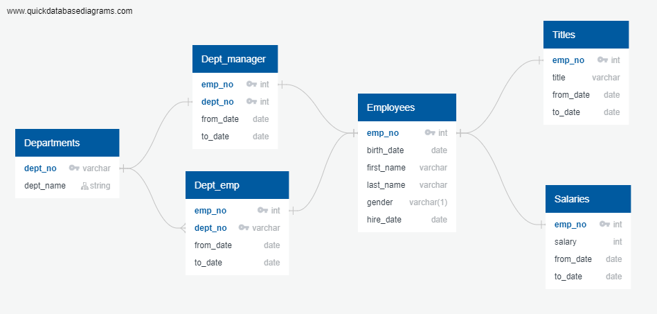

# sql-challenge

## File Breakdown ##

* analysis.ipynb - contains exercise using `sqlalchemy` to connect to postgres database
* query.sql - sql queries
* schema.sql - creates tables as shown in the above ERD

## Dependencies ##
The following need to be installed before running the notebook:

* [matplotlib](https://matplotlib.org/)
* [pandas](https://pandas.pydata.org/)
* [psycopg2](https://pypi.org/project/psycopg2/)
* [sqlalchemy](https://www.sqlalchemy.org/)
